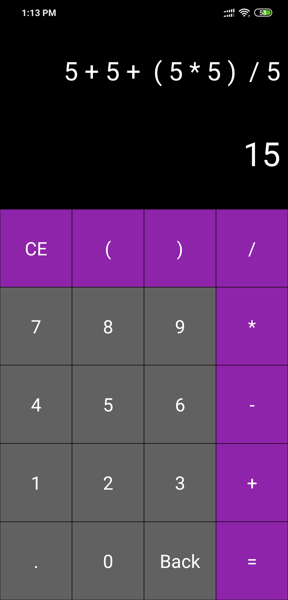

# Android-Calculator
Android Calculator is an simple calculator that performs various complex calculations with ease. This app is made in Kotlin on top of Android Platform. Fork, learn and use it for your projects.

# Unit test
The simple test methods are created using Espresso with JUnit framework.

## Screenshots:

